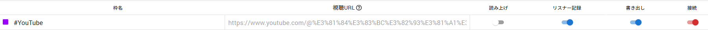

# 使い方

## 初回設定

`初回のみ.bat`をダブルクリックで実行し、必要なテンプレートをコピーします。

わんコメを起動し、一番上に安価配信を取得したいURLを指定する。

準備ができたら「接続」する。

左上の「追加」ボタンをクリックし、「書き出し」と「接続」をオンにする。

## 実行時

`start.bat`をダブルクリックで実行します。

もし「Windows によってPCが保護されました」との青い画面が出た場合、「詳細情報」をクリック後、「実行」から内容を確認して実行してください。

問題なく実行できると黒い（コンソール）画面が2つ出ますが、完了するまでどちらも消去しないでください。

## エラー発生時

エラーなど、不具合が生じた場合は`log`フォルダに開始時刻のファイル名でログが出力されるので、そちらを連携ください。
